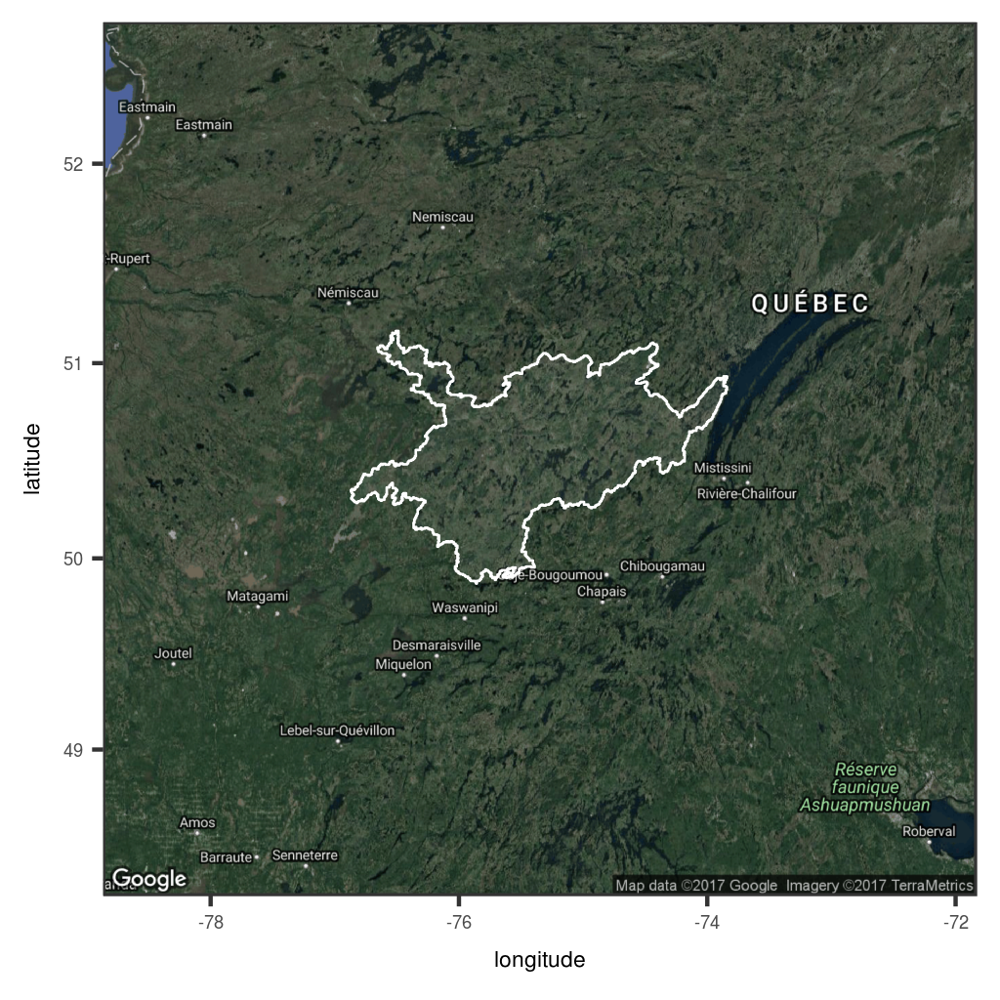
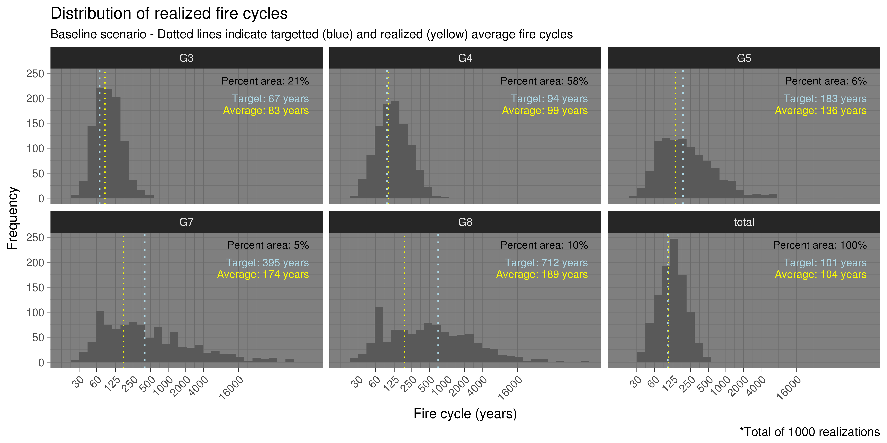

Mis à jour le 26 Mar 2018

-------

## Contexte

Vous trouverez ici le matériel nécessaire pour reproduire l'analyse de risque d'accident de régénération dans le territoire décrit ci-bas. Il s'agit toutefois d'un projet en développement qui n'est pas actuellement entièrement opérationel.

Ce projet vise à évaluer le risque d'accident de régénération suite à des perturbations en rafale (feux ou coupe suivie d'un feu). Nous avons pour le moment complété la phase visant à simuler les feux de forêt ainsi que le vieillissement des forêts après feu.

Un modèle de succès de régénération après feux, dépendant des conditions forestières préalables à la perturbation, est en court d'implémentation et sera couplé sous peu afin de permettre la quantification du risque d'accident de régénération.

------------

## Territoire à l'étude

Le territoire à l'étude est situé à l'est du lac Mistassini, tout juste au sud de la limite nordique des forêts attribuables. Il est d'une superficie totale de 1.2 Mha, excluant les grands cours d'eau. 

------------

## Modèle de succès de régénération après feu

En cours d'implémentation. À suivre!

Contact: [Tadeusz Splawinski][7]

------------

## Modèle de feu

Le modèle de feu est basé sur l'expérience de simulation décrite dans [Cyr _et al_. (2016)][1], qui visait à évaluer la justesse et précision de 3 types d'analyses de survie pouvant être utilisées pour estimer le cycles de feux à partir de données dendroécologiques. Les aspects techniques ainsi que le code permettant de reproduire cette expérience sont disponibles [ici][2].

Le modèle de feu a pour objectif de générer de manière stochastique et spatialement explicite autant de séries d'événements de feux que souhaité dans un paysage donné. Ce paysage peut être formé uniquement de pixels "inflammables" ou d'une combinaison de pixels inflammables et de pixels ne pouvant pas brûler (ex. cours d'eau).

### Paramètres des régimes de feux

Afin de générer des séries d'événements de feu réalistes, les paramètres suivants du régime des feux doivent être spécifiés:

* Le risque moyen $\lambda$ (ou la durée du cycle des feux)
* La distribution de taille de feux

Fait à noter que ces paramètres peuvent varier au cours d'une même simulation, pour tenir compte des changements climatiques ou d'un effet de la suppression des feux, par exemple. Dans le cas présent, seul un scénario de changements climatique a été simulé. (Voir [dispositif expérimental][9].)

Comme le cycle des feux ($cycle = 1/\lambda$), la taille moyenne des feux $\bar{S}$ (dérivée de la distribution de tailles), la taille du territoire à l'étude $A$ et la durée de la simulation _T_ sont ainsi définis *a priori*, il devient possible de déterminer le nombre de feux à simuler à chaque pas de temps $\bar{N}$ en l'isolant de l'équation suivante:

<!--  

 --> 

Tel qu'actuellement simulé, le nombre "d'allumages" est une variable aléatoire résultant de tirage d'un distribution de Poisson de moyenne $\bar{N}$.

### Patron spatiaux

Le régime de feu peut également être spatialement hétérogène à l'échelle du paysage. Dans le cas présent, les cycles de feux sont tirés de [Gauthier et al. 2015][8]. Il est à noter que les régimes de feux réalisés dans chacune des zones ne dépendront pas seulement des cibles, mais seront aussi influencées par les régimes de feux simulés dans par les zones avoisinantes; les frontières n'étant pas imperméables à la propagation des feux d'une zone à l'autre.

À l'échelle individuelle, les feux sont le produit d'un [automate cellulaire][4] de propagation stochastique aux cellules avoisinantes, c'est-à-dire que les cellules "allumées" ont une probabilité pré-déterminée de propager le feu aux cellules avoisinantes jusqu'à l'atteinte d'une superficie totale elle aussi pré-déterminée.

Tel qu'actuellement configuré, le modèle de propagation épargne entre 5% et 15% des pixels éligibles lors de feux de grandes superficies. Il s'agit de proportions comparables aux observations faites par imagerie satellitaire [Madoui _et al_. (2010)][3] dans un territoire similaire.

------------

### Exemple d'une simulation de 50 ans

À ce stade, le modèle de feu est relativement simple, mais pourraient s'ajouter au besoin quelques autres éléments pour en augmenter le réalisme ou pour tester certaines hypothèses. Comme par exemple:

* Variabilité temporelle du risque de feux (ex. changements climatiques)
* Effets de la topographie
* Effets des vents dominants
* Risque de feu variable en fonction des combustibles
* Sévérité partielle
* ...

### Propriétés d'un ensemble de simulation

Afin de vérifier le bon fonctionnement du modèle de feu, nous avons effectué 1000 simulations et quantifié les cycles de feux réalisés.

Ces simulations confirment que les régimes de feux sont presque parfaitement simulés pour le territoire à l'étude dans son ensemble (cycle global de 101 ans).

Par contre, elles montrent que les plus petites portions du territoire à l'étude, par effet de contagion, sont affectées par les régimes de feu des zones adjacentes. Cela est particulièrement notable pour les petites régions en principe soumises à des cycles de feux relativement longs, mais situées à proximité de régions brûlant davantage (ex. zones G7 et G8). Cela est tout à fait normal compte tenu que les frontières ne sont pas imperméables à la propagation des feux d'une zone à l'autre.

De plus, la variabilité simulée sera plus grande lorsque la zone est petite par rapport à la taille moyenne des feux, ainsi que lorsque le cycle ciblé est long par rapport à la durée de la simulation (ici 50 ans). Cela est cohérent avec les observations empiriques documentées ainsi qu'avec les expériences de simulation antérieures.

-------------

## Dispositif expérimental

L'ensemble de simulations est le produit d'un disposif factoriel à deux facteurs comportant deux scénarios de changements climatiques, et deux traitements de récoltes, produisant ainsi un total de quatre combinaisons.

* Feux (baseline) sans récolte  
* Feux (baseline) avec récolte  
* Feux (RCP 8.5) sans récolte  
* Feux (RCP 8.5) avec récolte

Le régime de feu *baseline* est issu de [Gauthier et al. 2015][8], et correspond à celui qui est illustré à la figure précédente, tandis que le régime de feu RCP 8.5 est tiré de [Boulanger et al. 2014][10].

[insérer ici les taux/cycles tirés de Boulanger et al]

Pour chacune des combinaisons, 1000 simulations d'une durée de 50 ans sont effectuées.

Dans le cas du traitement avec récolte, un taux de récolte, calculé à partir des récoltes effectuées de 2002 à 2011 dans le territoire à l'étude, est appliqué de manière homogène sur tous les types de couverts considérés comme productifs. Les peuplements élligibles à la récolte sont ceux d'un âge supérieur ou égal à un seuil prédéterminé.

[insérer tableau "types de couverts et âge min pour la récolte"]

-------------

## Pour plus d'information

N'hésitez pas à nous contacter!

[Dominic Cyr][5]  
[Sylvie Gauthier][6]  
[Tadeusz Splawinski][7]  

[1]: http://www.mdpi.com/1999-4907/7/7/131/html
[2]: https://github.com/dcyr/survFire
[3]: http://www.publish.csiro.au/wf/WF10049
[4]: https://fr.wikipedia.org/wiki/Automate_cellulaire
[5]: http://dominiccyr.ca
[6]: https://scf.rncan.gc.ca/employes/vue/sgauthie
[7]: http://www.cef-cfr.ca/index.php?n=Membres.TadeuszSplawinski
[8]: http://www.nrcresearchpress.com/doi/10.1139/cjfr-2014-0125#.WEHWNnUrLRY
[9]: https://github.com/dcyr/risqueAccidentRegen#dispositif-expérimental
[10]: http://www.nrcresearchpress.com/doi/abs/10.1139/cjfr-2013-0372
