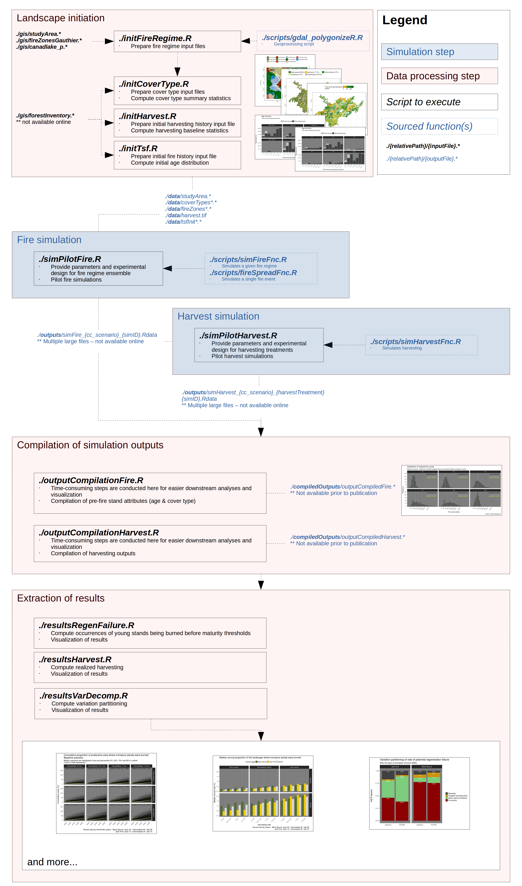

[Dominic Cyr][5]

Updated on Jun 19 2018

-----------

The following describes the simulation and data processing pipeline that allows to reproduce the experiment conducted by Splawinski _et al_. (under review). That experiment aims at assessing the relative risk of regeneration failure following successive disturbances in a variety of contexts.

For a specific description of the estimation methods, please refer to the paper itself (under review). For more details about the implementation in R, please refer to the figure below and individual scripts. The following figure illustrates the several scripts that should be executed in sequence by the user. Note that the simulation steps may takes hours to execute depending on the simulation parameters even if many of them make use of parallel calculations. To allow for testing and proper verification at each steps, all intermediate and final outputs are first written in a folder named after the current date (ex. "_./{Sys.date}/outputs.file_"). They must then be copied manually into the folder indicated below in order to serve as inputs for downstream processing.

Don't hesitate to contact me should you have questions, comments or suggestions for improvement or additionnal functionalities.

[Dominic Cyr][5]

-----------

[1]: http://www.mdpi.com/1999-4907/7/7/131/html
[2]: https://github.com/dcyr/survFire/tree/master/scripts
[3]: https://github.com/dcyr/survFire/blob/master/pipeline.md
[5]: http://dominiccyr.ca
